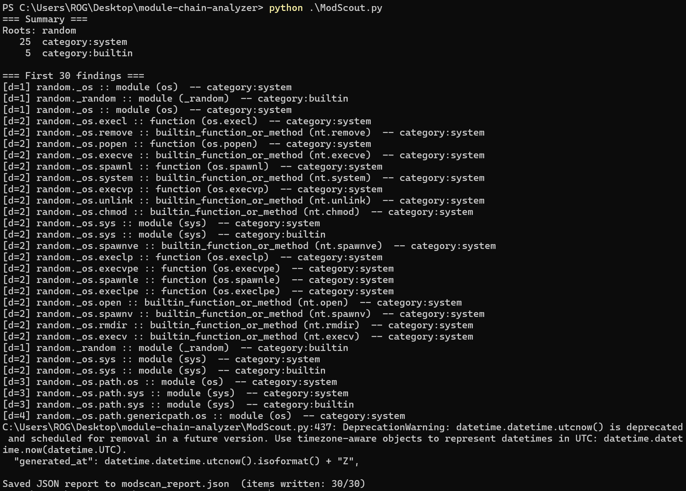

<div align="center">
  
  <h1>ModScout</h1>
  <p><b>Scout dangerous paths in Python modules — safely.</b></p>
  <p><i>A Python module graph explorer that reveals hidden routes to sensitive modules, callables, and builtins.</i></p>
  <p><b>Author:</b> Ivan, Johns Hopkins University</p>
  
</div>

---

## 🔍 What is ModScout?

**ModScout** recursively walks a module’s attributes (via `dir()`) to reveal potentially dangerous or interesting connections—like how `random` might indirectly reach `os.system`. It’s a safe, standalone tool for **security auditing, dynamic analysis**, and **curiosity-driven inspection**.

Think of it as a **metal detector for Python’s module graph**.

---

## ✨ Highlights

- 🚦 **Safe-first traversal**: reads only from `__dict__` by default  
- 🧠 **Smart matching**: categories (`system`, `builtin`, `dangerous`) + regex + explicit names  
- ⚙️ **Fully configurable**: JSON-driven rules and scan parameters  
- 🧾 **Readable output**: console summary + structured JSON report  
- 🧰 **No dependencies**: uses only the Python standard library  

---

## ⚡ Quick Start

### Requirements
- Python **3.8+** (3.11+ recommended)
- No installation needed

### Run it

```bash
# Show help
python ModScout.py -h

# Generate an example config
python ModScout.py --write-example

# Run using the default example config
python ModScout.py -c modscan.example.json

# Or run ad-hoc without config file
python ModScout.py --roots random --targets system,builtin --max-depth 3
```

> 💡 On Windows, use `py -3.11 ModScout.py` if needed.

---

## 🗂️ Repository Layout

```
.
├─ ModScout.py                # main analyzer (single file, no dependencies)
├─ modscan.example.json       # safe starter config
├─ dangerous.json             # broad config for high-risk discovery
├─ dangerous_report.json      # example output from a scan
├─ cpython.json               # optional: scan config for CPython internals
├─ Demo.png                   # sample run screenshot (as shown above)
├─ logo.png                   # pixel-style ModScout logo
├─ LICENSE                    # MIT
├─ .gitignore
└─ README.md
```

---

## 🧩 Configuration Overview

ModScout uses **JSON configs**. Key sections:

- `roots`: root modules to start traversal from
- `rules`: matching criteria (category, regex, names, etc.)
- `categories`: custom lists of modules/callables grouped by theme
- `scan`: traversal settings (depth, risk, pruning)
- `output`: report configuration

---

### Example: `modscan.example.json`

```json
{
  "roots": ["random"],
  "rules": [
    { "type": "category", "category": "system" },
    { "type": "category", "category": "builtin" }
  ],
  "categories": {
    "system": {
      "modules": ["os", "subprocess", "ctypes", "socket", "ssl", "shutil"],
      "callables": ["system", "run", "Popen", "fork"]
    }
  },
  "scan": {
    "max_depth": 4,
    "max_objects": 60000,
    "risk_getattr": false,
    "prune_dunders": true
  },
  "output": {
    "json_path": "modscan_report.json",
    "limit": 2000
  }
}
```

---

### Example: `dangerous.json`

A “maximal paranoia” config—enumerates filesystem, subprocess, import, and network modules/functions.

```json
{
  "roots": ["random"],
  "rules": [
    { "type": "category", "category": "dangerous" },
    { "type": "qualname_regex", "pattern": "(^|\\.)builtins\\.(eval|exec|compile|open|__import__|input)$" }
  ],
  "categories": {
    "dangerous": {
      "modules": ["os", "sys", "subprocess", "ctypes", "socket", "ssl", "importlib"],
      "callables": ["system", "run", "exec", "eval", "open", "__import__"]
    }
  },
  "scan": {
    "max_depth": 6,
    "max_objects": 120000,
    "risk_getattr": false
  },
  "output": {
    "json_path": "dangerous_report.json",
    "limit": 10000
  }
}
```

---

## 🧾 Output

Each run prints a console summary and writes a JSON report:

**Example Output (CLI):**
```
=== Summary ===
Roots: random
25  category:system
5   category:builtin

=== First 30 findings ===
[d=1] random._os :: module (os) -- category:system
[d=2] random._os.system :: function (os.system) -- category:system
[d=2] random._os.remove :: builtin_function_or_method (nt.remove) -- category:system
...
Saved JSON report to modscan_report.json (items written: 30/30)
```

**Report fields:**
- `path`: full dotted path (e.g., `random._os.system`)
- `depth`: how deep it was found
- `object`: type, module, qualname, origin
- `match`: which rule triggered and why

---

## 🧠 Safety Notes

- 🧱 Default traversal only inspects existing attributes; no arbitrary code runs.
- ⚠️ Enabling `--risk-getattr` may trigger imports or property code—sandbox before use.
- 🐢 Deep scans of large frameworks (`torch`, `tensorflow`) may take time—exclude them via `exclude_module_prefixes`.

> The `DeprecationWarning` seen in some environments (`datetime.utcnow()`) is harmless and will be addressed with a timezone‑aware patch.

---

## 🧰 CLI Reference

```text
-c, --config PATH            Use a JSON config file
--roots r1,r2                Comma-separated roots (overrides config)
--targets t1,t2              Add quick category rules (e.g., system,builtin)
--max-depth N                Set recursion depth
--risk-getattr               Use getattr() if __dict__ missing (unsafe)
--json-out PATH              Output JSON report file path
--limit N                    Limit findings in JSON (0 = no limit)
--write-example              Generate modscan.example.json and exit
```

---

## 💡 Pro Tips

- **Find a specific object**:  
  `{ "type": "qualname", "pattern": "random._os.system" }`
- **Match any callable name**:  
  `{ "type": "callable_name", "pattern": "open" }`
- **Create your own category** (e.g., networking):  
  ```json
  { "modules": ["socket", "ssl"], "callables": ["create_connection"] }
  ```

---

## 🤝 Contributing

Pull requests are welcome!  

---

## 🪪 License

**MIT License** — see [`LICENSE`](LICENSE).

---

<div align="center">
  <sub>🕵️‍♂️ ModScout — Finding the hidden paths since 2025.</sub>
</div>
